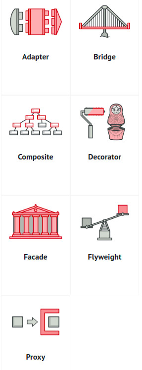

# Classification of patterns

* `The most basic and low-level patterns` are often called `idioms`. They usually apply only to a `single programming language.`

* `The most universal and high-level patterns` are `architectural patterns.` Developers can implement these patterns in `virtually any language.` Unlike other patterns, they can be used to design the architecture of an entire application.

### Categorized by their intent, or purpose.

* `Creational patterns` provide `object creation mechanisms` that `increase flexibility` and `reuse of existing code`.
  * 

* `Structural patterns `explain `how to assemble objects and classes into larger structures`, while `keeping` the structures `flexible and efficient.`
  * 

* `Behavioral patterns` take care of `effective communication` and the `assignment of responsibilities` between `objects.`
  * 
